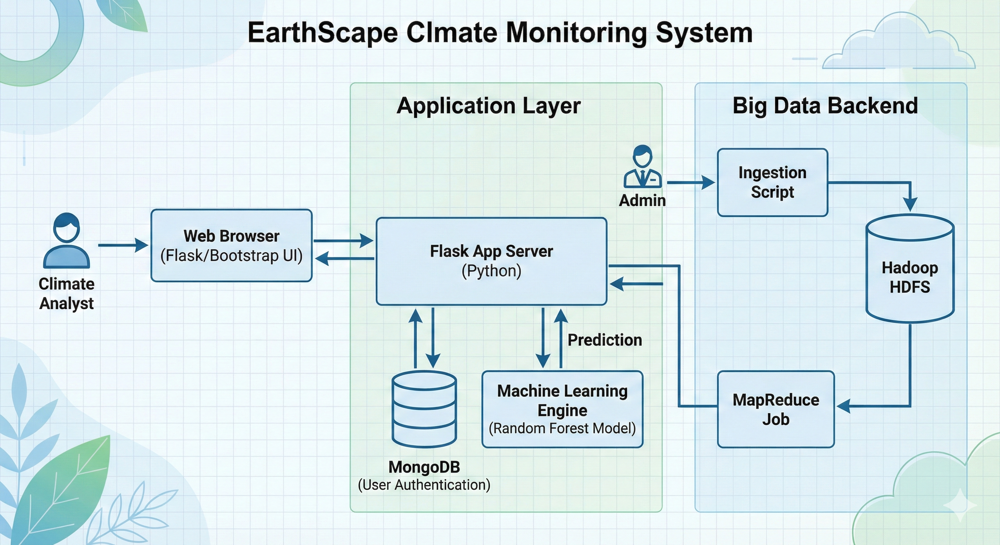

# 🌍 EarthScape Climate Monitoring System


**EarthScape** is a comprehensive Big Data solution designed to monitor global temperature trends, ingest satellite data, and predict future climate anomalies using Machine Learning.

---

## 📖 Table of Contents
- [Overview](#-overview)
- [Key Features](#-key-features)
- [System Architecture](#-system-architecture)
- [Tech Stack](#-tech-stack)
- [Installation & Setup](#-installation--setup)
- [Usage Guide](#-usage-guide)
- [Project Structure](#-project-structure)
- [Contact](#-contact)

---

## 🔭 Overview
Climate change requires robust data processing capabilities. EarthScape provides a unified platform for:
1.  **Ingesting** massive datasets from weather stations and satellites into **HDFS**.
2.  **Processing** historical records using **MapReduce** algorithms.
3.  **Predicting** future temperatures with a **Random Forest** regression model.
4.  **Visualizing** trends via an interactive Analyst Dashboard.

---

## ✨ Key Features

### 🔐 User & Role Management
* **Secure Authentication:** SHA-256 hashed passwords.
* **Role-Based Access:** Separate views for **Climate Analysts** and **System Administrators**.

### 🏗️ Big Data & Backend
* **HDFS Ingestion:** Automated scripts to upload CSV datasets to a Hadoop Cluster.
* **MapReduce Processing:** Python-based jobs (`mrjob`) to calculate yearly average temperatures across petabytes of data.
* **Real-Time Streaming:** Simulated sensor stream processor for detecting critical heat anomalies (`>38°C`).

### 🤖 Machine Learning Engine
* **Predictive Model:** Random Forest Regressor trained on 100+ years of global city data.
* **Accuracy:** High precision forecasting for major global cities.
* **Visualization:** Dynamic generation of trend graphs using Matplotlib & Seaborn.

### 💻 Modern UI/UX
* **Analyst Dashboard:** Interactive date pickers and real-time HDFS status indicators.
* **Responsive Design:** "Earth & Science" themed UI built with Bootstrap 5.
* **Floating Alerts:** Non-intrusive toast notifications for system messages.

---

## 🏗 System Architecture

The application follows a modular MVC (Model-View-Controller) pattern integrated with Big Data pipelines.

1.  **Frontend:** Flask (Jinja2 Templates), Bootstrap 5.
2.  **Backend:** Python 3.10+.
3.  **Database:** MongoDB (User credentials & logs).
4.  **Storage:** Hadoop Distributed File System (HDFS) for raw CSVs.
5.  **Analytics:** Scikit-Learn (ML) and Pandas.



---

## 🛠 Tech Stack

| Component | Technology |
| :--- | :--- |
| **Web Framework** | Flask |
| **Database** | MongoDB Community |
| **Big Data** | Apache Hadoop, HDFS, MapReduce |
| **ML Libraries** | Scikit-Learn, Pandas, NumPy |
| **Visualization** | Matplotlib, Seaborn |
| **Frontend** | HTML5, CSS3, Bootstrap 5, Bootstrap Icons |

---

## 🚀 Installation & Setup

### Prerequisites
* Python 3.10+
* MongoDB (Running locally on default port `27017`)
* Git LFS (Required to download the model files)

### 1. Clone the Repository
Ensure you have Git LFS installed to pull the large model files automatically.
```bash
git lfs install
git clone https://github.com/MohsinKhanAptech/EarthScape-Climate-Agency.git
cd earthscape-climate-system
````

### 2\. Navigate to Application Code

The source code is located in the website directory.

```bash
cd EarthScape-Website
```

### 3\. Create & Activate Virtual Environment

```bash
# Windows
python -m venv .venv
.venv\Scripts\activate

# Mac/Linux
python3 -m venv .venv
source .venv/bin/activate
```

### 4\. Install Dependencies

```bash
pip install -r requirements.txt
```

### 5\. Configure Environment

Create a `.env` file in the `EarthScape-Website` folder:

```bash
MONGO_URI=mongodb://localhost:27017/earthscape_db
SECRET_KEY=your_dev_secret_key
MAIL_SERVER=smtp.gmail.com
MAIL_PORT=587
MAIL_USE_TLS=True
MAIL_USERNAME=your-email@example.com
MAIL_PASSWORD=your-app-password
```

### 6\. Run the Application

```bash
python run.py
```

*Visit `http://127.0.0.1:5000` in your browser.*

-----

### Optional: Retraining the Model

If you want to update the dataset or regenerate the models yourself:

```bash
python training/train_model.py
```

-----

## 🎮 Usage Guide

### 1\. The Analyst Dashboard

1.  **Sign Up** as a new user.
2.  Navigate to the **Dashboard**.
3.  Select a **City** (e.g., London) and a **Future Date** (e.g., July 2030).
4.  Click **Run Prediction**.
5.  View the predicted temperature and the generated trend line graph.

### 2\. Data Ingestion (Admin)

1.  Navigate to the **Ingestion** tab.
2.  Upload a `.csv` dataset.
3.  The system will simulate an upload to the `/user/earthscape/climate_data/` HDFS directory.

### 3\. Running Big Data Scripts (Terminal)

To run the MapReduce job manually:

```bash
python big_data/map_reduce_jobs.py data/GlobalLandTemperaturesByMajorCity.csv
```

### 4\. Retraining the Model (Optional)

If you update the dataset or want to regenerate the `.pkl` files, run this from the `EarthScape-Website` directory:

```bash
python training/train_model.py
```

-----

## 📂 Project Structure

```text
EarthScape-Climate-Agency/
├── Dataset/             # Raw Global Climate CSV Data
├── Docs/                # Documentation, Reports & Diagrams
├── EarthScape-Website/  # Main Application Source Code
│   ├── app/
│   │   ├── models/      # ML Models (.pkl) & Logic
│   │   ├── static/      # CSS, Images, Generated Plots
│   │   ├── templates/   # HTML Jinja2 Templates
│   │   └── ...
│   ├── big_data/        # Hadoop & MapReduce Scripts
│   ├── training/        # Model Training Scripts (train_model.py)
│   ├── config/          # Configuration Classes
│   ├── tests/           # Unit Tests
│   ├── run.py           # Application Entry Point
│   └── requirements.txt # Python Dependencies
└── README.md            # Project Documentation
```

-----

## 🤝 Contributing

1.  Fork the repository.
2.  Create your feature branch (`git checkout -b feature/AmazingFeature`).
3.  Commit your changes (`git commit -m 'Add some AmazingFeature'`).
4.  Push to the branch (`git push origin feature/AmazingFeature`).
5.  Open a Pull Request.

-----

## 📜 License

This project is licensed under the MIT License.

-----

### 👤 Author

**Mohsin Khan**

  * EarthScape Climate Agency Project
  * **Batch:** 2301C1

<!-- end list -->
